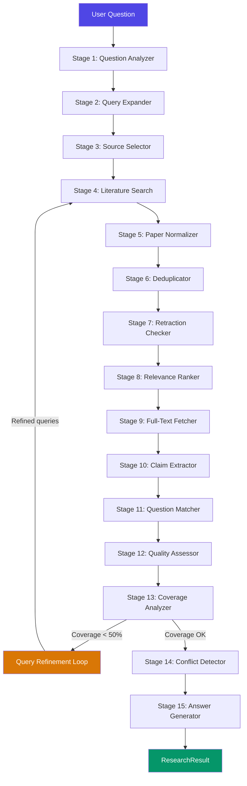

# Scientific Evidence Research System — Pipeline Documentation

A full-stack system that takes a natural-language research question, searches
academic literature databases, and synthesizes an evidence-based answer with
full provenance and transparency.

---

## Table of Contents

- [Architecture Overview](#architecture-overview)
- [Technology Stack](#technology-stack)
- [Pipeline Stages](#pipeline-stages)
- [Data Flow Diagram](#data-flow-diagram)
- [Data Models](#data-models)
- [API Endpoints](#api-endpoints)
- [Configuration Reference](#configuration-reference)
- [Getting Started](#getting-started)

---

## Architecture Overview

```
┌─────────────────────────────────────────────────────────────────┐
│                     Frontend (HTML/CSS/JS)                       │
│                  static/index.html + app.js                     │
└────────────────────────────┬────────────────────────────────────┘
                             │ SSE / REST
                             ▼
┌─────────────────────────────────────────────────────────────────┐
│                    Flask Backend (app.py)                        │
│   POST /api/research   │   POST /api/research/stream            │
└────────────────────────────┬────────────────────────────────────┘
                             │
                             ▼
┌─────────────────────────────────────────────────────────────────┐
│                 Pipeline Orchestrator                            │
│              pipeline/orchestrator.py                            │
│                                                                 │
│  Coordinates 15 stages sequentially, collects metadata,         │
│  handles errors, supports SSE progress callbacks                │
└────────────────────────────┬────────────────────────────────────┘
                             │
          ┌──────────────────┼──────────────────┐
          ▼                  ▼                  ▼
   ┌─────────────┐   ┌─────────────┐   ┌─────────────┐
   │  CORE API   │   │ Europe PMC  │   │ Ollama LLM  │
   │  (papers)   │   │  (papers)   │   │  (local AI)  │
   └─────────────┘   └─────────────┘   └─────────────┘
```

The system follows a **linear pipeline architecture** where each stage
transforms and enriches the data before passing it to the next stage.
All LLM-powered stages use a centralized client (`pipeline/llm_client.py`)
that communicates with a local Ollama instance.

---

## Technology Stack

| Layer         | Technology                                        |
|---------------|---------------------------------------------------|
| **Frontend**  | HTML5, Vanilla CSS, Vanilla JS                    |
| **Backend**   | Python 3, Flask, Flask-CORS                       |
| **LLM**       | Ollama (local) — default model: `llama3.2`        |
| **APIs**      | CORE API v3, Europe PMC REST API                  |
| **Streaming** | Server-Sent Events (SSE) for real-time progress   |

---

## Pipeline Stages

### Stage 1 — Question Analysis
**Module:** `pipeline/question_analyzer.py`
**Powered by:** LLM (Ollama)

Parses the user's natural-language research question into structured
PICO(T) elements:

- **P**opulation — who is being studied
- **I**ntervention — what treatment/method is being investigated
- **C**omparator — what it's compared against
- **O**utcome — what is being measured
- **T**ime — treatment duration (if specified)

Also extracts domain classification (medical/scientific/mixed), question
type (intervention/diagnostic/prognostic/etiology/general), drug details
(dose, frequency, route), and key scientific concepts.

**Fallback:** Keyword-based domain guessing and basic concept extraction
if the LLM call fails.

---

### Stage 2 — Query Expansion
**Module:** `pipeline/query_expander.py`
**Powered by:** LLM (Ollama)

Generates 2–4 search query variations per source database using:
- Synonyms and abbreviations (e.g., "heart attack" → "myocardial infarction")
- Generic and brand drug names
- Alternative disease names
- Broader/narrower scientific terminology

Produces separate queries optimized for CORE (general scientific) and
Europe PMC (biomedical) databases.

**Fallback:** PICO-based and concept-based queries built from the
question analysis.

---

### Stage 3 — Source Selection
**Module:** `pipeline/source_selector.py`

Decides which literature databases to query based on the question domain:
- **Medical** domain → prioritize Europe PMC
- **Scientific** domain → prioritize CORE
- **Mixed** domain → query both

---

### Stage 4 — Literature Search
**Modules:** `pipeline/search_clients/core_client.py`, `pipeline/search_clients/europepmc_client.py`

Executes the expanded queries against the selected APIs:
- **CORE API** — searches ~300M+ open access research papers
- **Europe PMC** — searches 40M+ biomedical and life science publications

Rate limiting is enforced per API (configurable in `config.py`).

---

### Stage 5 — Paper Normalization
**Module:** `pipeline/paper_normalizer.py`

Transforms raw API responses from different sources into a unified
`NormalizedPaper` format with standardized fields for title, authors,
abstract, identifiers (DOI, PMID, PMCID), publication year, journal,
study type, keywords, and URLs.

---

### Stage 6 — Deduplication
**Module:** `pipeline/deduplicator.py`

Removes duplicate papers found across multiple sources and queries.
Matching is done by:
1. DOI (exact match)
2. PMID (exact match)
3. Title similarity (fuzzy matching)

When duplicates are found, source tracking is merged so the final
paper records which databases it appeared in.

---

### Stage 7 — Retraction Checking
**Module:** `pipeline/retraction_checker.py`

Flags papers with concerning publication statuses:
- **Retracted** — removed from literature
- **Corrected** — has errata/corrections
- **Expression of concern** — publisher has raised concerns
- **Withdrawn** — voluntarily removed by authors

Retracted and withdrawn papers are excluded from evidence synthesis
but retained in metadata for transparency.

---

### Stage 8 — Relevance Ranking
**Module:** `pipeline/relevance_ranker.py`

Scores and ranks all usable papers against the original question using
weighted criteria:

| Criterion            | Weight |
|----------------------|--------|
| Keyword relevance    | 30%    |
| PICO match           | 35%    |
| Study type           | 10%    |
| Recency              | 5%     |
| Full-text available  | 10%    |
| Evidence level       | 10%    |

Papers below the minimum relevance threshold (configurable) are filtered out.

---

### Stage 9 — Full-Text Fetching
**Module:** `pipeline/search_clients/fulltext_fetcher.py`

Fetches full-text XML from Europe PMC for the top-ranked papers that
have a PMCID. This provides richer text for claim extraction compared
to abstract-only papers. Limited to a configurable maximum number of
fetches to avoid excessive API calls.

---

### Stage 10 — Claim Extraction
**Module:** `pipeline/claim_extractor.py`
**Powered by:** LLM (Ollama)

Extracts individual, atomic evidence claims from each top-ranked paper.
Each claim includes:
- The claim text (closely paraphrased)
- Source section (abstract/results/discussion/conclusions)
- PICO mapping specific to this claim
- Effect direction (positive/negative/neutral/mixed/unclear)
- Effect size and statistical information (if reported)
- Confidence assessment

**Fallback:** Returns empty claims list if LLM call fails (logged in
pipeline metadata for transparency).

---

### Stage 11 — Question Matching
**Module:** `pipeline/question_matcher.py`

Compares each extracted claim against the user's specific question
dimensions using a field-by-field matching approach:

| Dimension         | Weight | Match levels              |
|-------------------|--------|---------------------------|
| Intervention      | 25%    | exact / partial / indirect / no_match |
| Outcome           | 20%    | exact / partial / indirect / no_match |
| Population        | 15%    | exact / partial / indirect / no_match |
| Dose              | 10%    | exact / partial / indirect / no_match |
| Comparator        | 10%    | exact / partial / indirect / no_match |
| Duration          | 5%     | exact / partial / indirect / no_match |
| Study design      | 5%     | exact / partial / indirect / no_match |
| Effect direction  | +5% bonus  | if not "unclear"     |
| Statistical info  | +5% bonus  | if present           |

Produces a composite `question_match_score` (0–1) for each claim.

---

### Stage 12 — Quality Assessment
**Module:** `pipeline/quality_assessor.py`

Evaluates evidence strength for each claim based on:

| Factor               | Weight | How assessed                        |
|----------------------|--------|-------------------------------------|
| Study design         | 35%    | Hierarchy from systematic review (0.95) to editorial (0.15) |
| Statistical precision| 25%    | Presence of CIs, p-values, effect sizes, sample sizes |
| Evidence level       | 15%    | Full-text (1.0) vs abstract (0.6) vs metadata (0.3) |
| Publication status   | 15%    | Normal (1.0), corrected (0.7), retracted (0.0) |
| Recency              | 10%    | Years since publication             |

Produces:
- `evidence_quality`: high / moderate / low / very_low
- `unified_score`: 50% question match + 50% quality score

---

### Stage 13 — Coverage Analysis + Query Refinement
**Module:** `pipeline/coverage_analyzer.py`
**Powered by:** LLM (Ollama) — for refinement queries only

Checks how well the retrieved evidence covers all dimensions of the
user's question (population, intervention, comparator, outcome, dose,
duration, study type).

If coverage score is below 50%, triggers **automatic query refinement**:
1. Identifies which dimensions are missing
2. Generates new targeted search queries (via LLM)
3. Re-runs stages 4–12 with the new queries
4. Merges results with existing evidence
5. Repeats up to 2 refinement rounds

---

### Stage 14 — Conflict Detection
**Module:** `pipeline/conflict_detector.py`
**Powered by:** LLM (Ollama) — for deeper conflict analysis

Groups claims by outcome/topic, then checks for directional
disagreements within each group:
- **Major conflicts**: positive vs. negative effect direction
- **Moderate conflicts**: positive/negative vs. neutral

Identifies potential reasons for conflicts:
- Different study populations
- Different study designs (RCT vs. observational)
- Different comparators

Uses LLM for deeper conflict analysis and resolution notes.
**Important:** Conflicts are presented honestly — never resolved
by majority voting.

---

### Stage 15 — Answer Generation
**Module:** `pipeline/answer_generator.py`
**Powered by:** LLM (Ollama)

Two-part final stage:

**a) Evidence Sufficiency Assessment** (rule-based):
- `sufficient` — ≥3 high/moderate quality claims, ≥2 good matches, ≥60% coverage, no major conflicts
- `partially_sufficient` — ≥1 high/moderate quality claim, ≥1 good match
- `insufficient` — below thresholds

**b) Answer Synthesis** (LLM-powered):
- Starts with a direct answer
- Summarizes strongest evidence with inline citations [1], [2]
- Explains conflicts honestly
- Indicates evidence strength and limitations
- Distinguishes evidence from interpretation
- Explicitly states when evidence is insufficient

**Fallback:** Basic bullet-point answer listing top claims if the LLM
call fails.

---

## Data Flow Diagram



---

## Data Models

All models are defined in `pipeline/models.py` as Python `dataclass` objects.

### QuestionAnalysis
Structured understanding of the user's question — PICO(T) elements,
domain, question type, drug details, key concepts.

### ExpandedQueries
Search query variations: `core_queries`, `europepmc_queries`, synonyms used.

### NormalizedPaper
Unified paper representation: identifiers (DOI/PMID/PMCID/CORE ID),
metadata (title, authors, journal, year), content (abstract, full text),
classification (study type, publication status), and scores (relevance,
quality, evidence).

### ExtractedClaim
An individual evidence claim: claim text, source paper, PICO mapping,
effect direction/size/statistics, question match scores, quality
assessment, unified score.

### CoverageReport
Evidence coverage: per-dimension coverage flags, overall score, missing
areas, refinement suggestions.

### ConflictReport
A disagreement between studies: topic, conflicting claims, conflict type,
potential reasons, resolution notes, severity.

### PipelineMetadata
Transparency metadata: question interpretation, search terms, papers
found/deduplicated/retracted, claims extracted, processing stages with
timestamps, errors encountered.

### ResearchResult
Complete pipeline output: question, answer, confidence, all structured
components (analysis, queries, papers, claims, coverage, conflicts,
citations, metadata).

---

## API Endpoints

| Endpoint              | Method | Description                                  |
|-----------------------|--------|----------------------------------------------|
| `/`                   | GET    | Serve the frontend                           |
| `/api/research`       | POST   | Run full pipeline, return JSON result        |
| `/api/research/stream`| POST   | Run pipeline with SSE streaming for progress |
| `/api/health`         | GET    | Health check                                 |

### POST /api/research
**Request:**
```json
{ "question": "Does metformin reduce cardiovascular events in type 2 diabetes?" }
```
**Response:** Full `ResearchResult` JSON.

### POST /api/research/stream
Same request body. Returns an SSE stream with events:
```
data: {"type": "progress", "stage": "analyzing_question", "data": {...}}
data: {"type": "progress", "stage": "search_complete", "data": {"total": 35}}
...
data: {"type": "result", "data": {<full ResearchResult>}}
```

---

## Configuration Reference

All settings are in `config.py`, overridable via environment variables.

### Ollama (Local LLM)
| Setting           | Default                    | Description                    |
|-------------------|----------------------------|--------------------------------|
| `OLLAMA_BASE_URL` | `http://localhost:11434`   | Ollama API endpoint            |
| `OLLAMA_MODEL`    | `llama3.2`                 | Model name to use              |

### API Keys
| Setting         | Default | Description                              |
|-----------------|---------|------------------------------------------|
| `CORE_API_KEY`  | `""`    | CORE API key (get from core.ac.uk)       |

### Rate Limiting
| Setting                    | Default | Description                        |
|----------------------------|---------|------------------------------------|
| `CORE_RATE_LIMIT_DELAY`   | `6.5s`  | Delay between CORE requests        |
| `EUROPEPMC_RATE_LIMIT_DELAY` | `0.4s` | Delay between Europe PMC requests |
| `API_TIMEOUT`              | `30s`   | Timeout per API request            |

### Pipeline Parameters
| Setting                       | Default | Description                          |
|-------------------------------|---------|--------------------------------------|
| `MAX_PAPERS_PER_SOURCE`      | `20`    | Max papers per source per query      |
| `MAX_PAPERS_FOR_CLAIMS`      | `8`     | Top papers to extract claims from    |
| `MAX_FULLTEXT_FETCHES`       | `5`     | Max full-text XML fetches            |
| `MAX_QUERY_REFINEMENT_RETRIES`| `2`    | Max search refinement rounds         |
| `MIN_RELEVANCE_SCORE`        | `0.15`  | Minimum relevance to keep a paper    |

### Scoring Weights
| Setting                   | Default | Description               |
|---------------------------|---------|---------------------------|
| `WEIGHT_KEYWORD_RELEVANCE`| `0.30`  | Keyword match weight      |
| `WEIGHT_PICO_MATCH`       | `0.35`  | PICO element match weight |
| `WEIGHT_STUDY_TYPE`       | `0.10`  | Study design weight       |
| `WEIGHT_RECENCY`          | `0.05`  | Publication recency weight|
| `WEIGHT_FULLTEXT`         | `0.10`  | Full-text availability    |
| `WEIGHT_EVIDENCE_LEVEL`   | `0.10`  | Evidence depth weight     |

---

## Getting Started

### Prerequisites
- **Python 3.9+**
- **Ollama** — install from [ollama.com](https://ollama.com)
- **CORE API key** — get from [core.ac.uk/api-keys](https://core.ac.uk/api-keys)

### 1. Install Ollama & Pull a Model

```bash
# Install Ollama (see https://ollama.com for your OS)
# Then pull the default model:
ollama pull llama3.2
```

### 2. Start Ollama

```bash
ollama serve
```

### 3. Install Python Dependencies

```bash
pip install -r requirements.txt
```

### 4. Configure Environment

```bash
cp .env.example .env
# Edit .env and add your CORE API key
```

### 5. Run the Application

```bash
python app.py
```

The app starts at `http://localhost:5000`.

### Changing the LLM Model

Edit `.env` or `config.py`:
```bash
OLLAMA_MODEL=mistral        # or llama3.1, gemma2, etc.
```

Any Ollama-compatible model works. For best results with this pipeline,
use models that follow JSON output instructions well (e.g., `llama3.2`,
`mistral`, `gemma2`).

---

## Project Structure

```
Industrial Project/
├── app.py                          # Flask application (routes + SSE)
├── config.py                       # Central configuration
├── requirements.txt                # Python dependencies
├── .env.example                    # Environment variable template
├── PIPELINE.md                     # This file
├── static/
│   ├── index.html                  # Frontend HTML
│   ├── styles.css                  # Frontend styles
│   └── app.js                      # Frontend logic
└── pipeline/
    ├── __init__.py
    ├── models.py                   # Data classes (all pipeline models)
    ├── orchestrator.py             # Pipeline coordinator (15 stages)
    ├── llm_client.py               # Centralized Ollama LLM client
    ├── question_analyzer.py        # Stage 1: PICO extraction
    ├── query_expander.py           # Stage 2: Search query generation
    ├── source_selector.py          # Stage 3: API source selection
    ├── paper_normalizer.py         # Stage 5: Unified paper format
    ├── deduplicator.py             # Stage 6: Duplicate removal
    ├── retraction_checker.py       # Stage 7: Retraction flagging
    ├── relevance_ranker.py         # Stage 8: Paper scoring & ranking
    ├── claim_extractor.py          # Stage 10: Evidence claim extraction
    ├── question_matcher.py         # Stage 11: Claim-question matching
    ├── quality_assessor.py         # Stage 12: Evidence quality scoring
    ├── coverage_analyzer.py        # Stage 13: Coverage + refinement
    ├── conflict_detector.py        # Stage 14: Conflict detection
    ├── answer_generator.py         # Stage 15: Answer synthesis
    └── search_clients/
        ├── __init__.py
        ├── core_client.py          # CORE API client
        ├── europepmc_client.py     # Europe PMC API client
        └── fulltext_fetcher.py     # Stage 9: Full-text XML fetcher
```
