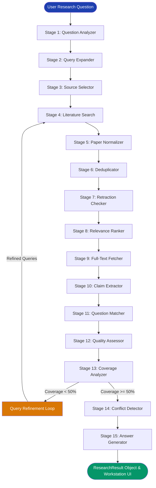

# Scientific Evidence Research Workstation — System Architecture & Implementation Audit

A comprehensive technical reference detailing the architecture, component implementation, algorithmic design, and verification status of the Scientific Evidence Research Workstation.

---

## 1. Executive Overview & System Purpose

The **Scientific Evidence Research Workstation** is a full-stack, local-first scientific evidence discovery and synthesis engine. It bridges the gap between raw academic literature databases and synthesized clinical/scientific summaries by replacing ungrounded LLM generation with a **15-stage deterministic and AI-powered evidence pipeline**.

### Core Value Proposition
- **Provenance & Verification**: Every extracted claim, percentage, hazard ratio, and conclusion is linked to a verified DOI, PMID, or PMCID.
- **Zero Hallucination Architecture**: Claims are extracted directly from peer-reviewed publications retrieved via live APIs.
- **Methodological Rigor**: Evidence is ranked, deduplicated, checked for retractions, graded by Oxford-style study design hierarchies, and analyzed for inter-study conflicts.
- **Resilience**: Operates with live local LLM inference (Ollama) with automatic circuit breaker fallback to deterministic NLP heuristics if the LLM is unavailable.

---

## 2. High-Level Architecture & Data Flow

```
┌─────────────────────────────────────────────────────────────────────────────────┐
│                     Frontend: Multi-Window Desktop Workstation                  │
│                     (HTML5 / Vanilla CSS / Vanilla JS Canvas 2D)                │
└────────────────────────────────────────┬────────────────────────────────────────┘
                                         │ POST /api/research/stream (SSE)
                                         ▼
┌─────────────────────────────────────────────────────────────────────────────────┐
│                           Flask Server (app.py)                                 │
│        Daemon Worker Thread  ◄──►  queue.Queue  ◄──►  SSE Keepalive Stream       │
└────────────────────────────────────────┬────────────────────────────────────────┘
                                         │
                                         ▼
┌─────────────────────────────────────────────────────────────────────────────────┐
│                     Pipeline Orchestrator (orchestrator.py)                     │
│                        Coordinates 15 Pipeline Stages                           │
└───────┬────────────────────────────────┬────────────────────────────────┬───────┘
        │                                │                                │
        ▼                                ▼                                ▼
┌─────────────────┐              ┌─────────────────┐              ┌─────────────────┐
│  Europe PMC API │              │    CORE API     │              │   Ollama LLM    │
│  - REST Search  │              │  - v3 Search    │              │  - JSON Format  │
│  - JATS XML     │              │  - Bearer Auth  │              │  - Local Worker │
└─────────────────┘              └─────────────────┘              └─────────────────┘
```

### 15-Stage Pipeline Sequence



---

## 3. Stage-by-Stage Component Breakdown

### Stage 1 — Question Protocol Analysis
- **File:** `pipeline/question_analyzer.py`
- **Purpose:** Transforms unstructured inquiries into structured clinical/scientific PICO(T) protocols.
- **Extraction Schema:**
  - `domain`: `medical`, `scientific`, or `mixed`
  - `question_type`: `intervention`, `diagnostic`, `prognostic`, `etiology`, or `general`
  - `PICO`: Population, Intervention, Comparator, Outcome, Condition
  - `Pharmacological`: Drug name, Dosage (e.g., `500 mg`), Frequency (e.g., `twice daily`), Route, Duration
  - `Concepts`: Array of key scientific terms
- **Primary Mechanism:** Local LLM with constrained JSON output.
- **Fallback Mechanism:** Regular expressions and keyword heuristics (`_populate_fallback_analysis`) extracting dosages (`\b\d+(?:\.\d+)?\s*(?:mg|mcg|g|ml)\b`), frequencies, and population structures (`in/for [patients with...]`).

### Stage 2 — Query Expansion
- **File:** `pipeline/query_expander.py`
- **Purpose:** Formulates targeted search queries for multiple academic database search engines.
- **Mechanisms:**
  - Translates colloquial terms to MeSH headings (e.g., "heart attack" $\rightarrow$ "myocardial infarction").
  - Formulates distinct query sets tailored for biomedical indexing (Europe PMC) vs. general scientific indexing (CORE).
  - Fallback constructor (`_build_fallback_queries`) builds PICO conjunction queries if the LLM is bypassed.

### Stage 3 — Intelligent Source Selection
- **File:** `pipeline/source_selector.py`
- **Purpose:** Directs search requests to the optimal literature repository based on domain classification and keyword density.
- **Routing Rules:**
  - `medical` $\rightarrow$ Europe PMC
  - `scientific` $\rightarrow$ CORE
  - `mixed` $\rightarrow$ Europe PMC + CORE
  - Reinforcement: Heuristic keyword scanner scans for $\ge 3$ biological or engineering keywords to ensure cross-domain coverage.

### Stage 4 — Multi-Source Literature Search
- **Files:** `pipeline/search_clients/europepmc_client.py`, `pipeline/search_clients/core_client.py`
- **Europe PMC Client:**
  - Uses REST API endpoint: `https://www.ebi.ac.uk/europepmc/webservices/rest/search`
  - Paginates via `cursorMark` tokens.
  - Extracts metadata, author affiliations, MeSH terms, publication types, open-access status, and citation counts.
- **CORE API Client:**
  - Uses REST API endpoint: `https://api.core.ac.uk/v3/search/works`
  - Transmits Bearer token in the `Authorization` header.
  - Enforces rate limiting (6.5s delay) to comply with free-tier quotas.

### Stage 5 — Paper Normalization
- **File:** `pipeline/paper_normalizer.py`
- **Purpose:** Harmonizes distinct data formats from CORE and Europe PMC into unified `NormalizedPaper` instances.
- **Standardized Properties:**
  - Identifiers: DOI, PMID, PMCID, CORE ID
  - Bibliographic: Title, Authors list (with affiliations), Journal, Pub Year, Pub Date
  - Evidence: Abstract, Full Text, Evidence Level (`full_text`, `abstract_only`, `metadata_only`)
  - Classification: Study Type, Document Type, Publication Status

### Stage 6 — Cross-Source Deduplication
- **File:** `pipeline/deduplicator.py`
- **Purpose:** Detects and merges duplicate publications retrieved across multiple queries and databases.
- **Matching Tiers:**
  1. Normalized DOI matching (stripping prefixes `https://doi.org/`, `http://dx.doi.org/`).
  2. PMID / PMCID matching.
  3. Normalized Title Jaccard Word Similarity ($>0.85$ with pub year verification within $\pm 1$ year, or $>0.92$ unconditional).
- **Metadata Merging:** Merges source tracking arrays, retains richer abstracts, preserves full-text attachments, and adopts the most severe publication status.

### Stage 7 — Retraction & Integrity Verification
- **File:** `pipeline/retraction_checker.py`
- **Purpose:** Protects synthesis integrity by identifying retracted, withdrawn, corrected, or flagged papers.
- **Detection Mechanisms:**
  - Europe PMC `commentCorrectionList` inspection for `retract`, `erratum`, `corrigendum`.
  - Title string matching for keywords: `RETRACTED`, `WITHDRAWN`, `EXPRESSION OF CONCERN`.
- **Handling:** Retracted and withdrawn papers are excluded from evidence synthesis while remaining recorded in the pipeline metadata audit trail.

### Stage 8 — Multi-Factor Relevance Ranking
- **File:** `pipeline/relevance_ranker.py`
- **Purpose:** Scores and sorts papers according to direct applicability to the research protocol.
- **Scoring Formula:**
  $$\text{Relevance} = \left( w_{\text{kw}} \cdot S_{\text{kw}} + w_{\text{pico}} \cdot S_{\text{pico}} + w_{\text{type}} \cdot S_{\text{type}} + w_{\text{rec}} \cdot S_{\text{rec}} + w_{\text{ft}} \cdot S_{\text{ft}} + w_{\text{lvl}} \cdot S_{\text{lvl}} \right) \times M_{\text{status}}$$
  - $w_{\text{kw}} = 0.30$ (Keyword Overlap)
  - $w_{\text{pico}} = 0.35$ (PICO Element Matches)
  - $w_{\text{type}} = 0.10$ (Study Design Match)
  - $w_{\text{rec}} = 0.05$ (Recency Decay)
  - $w_{\text{ft}} = 0.10$ (Full-Text Availability)
  - $w_{\text{lvl}} = 0.10$ (Evidence Depth Level)
  - $M_{\text{status}} = 0.50$ (Expression of Concern) or $0.85$ (Corrected)
- Filters out papers scoring below `MIN_RELEVANCE_SCORE` ($0.15$).

### Stage 9 — Full-Text XML Retrieval
- **File:** `pipeline/search_clients/fulltext_fetcher.py`
- **Purpose:** Fetches complete JATS XML full text for top-ranked papers with PMCIDs.
- **Mechanism:**
  - Queries `https://www.ebi.ac.uk/europepmc/webservices/rest/{pmcid}/fullTextXML`.
  - Parses XML hierarchy (`<sec>`, `<title>`, `<p>`, `<abstract>`) using `xml.etree.ElementTree`.
  - Extracts full body text structured by section name.

### Stage 10 — Atomic Claim Extraction
- **File:** `pipeline/claim_extractor.py`
- **Purpose:** Extracts discrete, evidence-bearing findings from each top-ranked paper.
- **Extracted Attributes:**
  - `claim_text`: Exact or closely paraphrased finding.
  - `source_section`: Abstract, Results, Discussion, or Conclusions.
  - `source_passage`: Supporting excerpt.
  - `effect_direction`: `positive`, `negative`, `neutral`, `mixed`, or `unclear`.
  - `effect_size`: E.g., `HR 0.78, 95% CI 0.65-0.93`, `p = 0.002`.
  - `statistical_info`: Numerical and statistical values.
- **Dual Engine:** LLM extraction with deterministic NLP sentence-scoring fallback (`_extract_claims_heuristic`).

### Stage 11 — Fine-Grained Question Matching
- **File:** `pipeline/question_matcher.py`
- **Purpose:** Compares each extracted claim against the user's specific inquiry dimensions.
- **Dimension Weights:**
  - Intervention / Drug: $25\%$
  - Outcome / Clinical Endpoint: $20\%$
  - Population / Age Group: $15\%$
  - Dose / Protocol: $10\%$
  - Comparator: $10\%$
  - Duration: $5\%$
  - Study Design: $5\%$
  - Bonuses: $+5\%$ for clear effect direction, $+5\%$ for reported statistics.
- **Match Levels:** `exact` ($1.0$), `partial` ($0.6$), `indirect` ($0.3$), `no_match` ($0.0$).

### Stage 12 — Evidence Quality & Unified Scoring
- **File:** `pipeline/quality_assessor.py`
- **Purpose:** Evaluates methodological strength and computes an Oxford-style evidence quality grade.
- **Quality Hierarchy:**
  - Systematic Reviews / Meta-Analyses: $0.95$
  - Randomized Controlled Trials (RCTs): $0.90$
  - Controlled Clinical Trials: $0.80$
  - Cohort / Prospective Studies: $0.65$
  - Case-Control Studies: $0.55$
  - Cross-Sectional / Observational: $0.50$
  - Case Reports: $0.30$
  - Editorials / Opinions: $0.15$
- **Unified Score:**
  $$\text{Unified Score} = 0.50 \cdot \text{Question Match Score} + 0.50 \cdot \text{Quality Score}$$

### Stage 13 — Evidence Coverage & Query Refinement Loop
- **File:** `pipeline/coverage_analyzer.py`
- **Purpose:** Validates whether all PICO dimensions are addressed in the extracted claims.
- **Refinement Loop:**
  - If coverage score is $<0.50$, the system triggers automated query refinement (up to 2 rounds).
  - Formulates targeted queries for missing dimensions, queries the APIs, deduplicates new papers, extracts additional claims, and recalculates coverage.

### Stage 14 — Conflict Detection & Disagreement Analysis
- **File:** `pipeline/conflict_detector.py`
- **Purpose:** Discovers and explains contradictory findings across studies without artificial majority voting.
- **Conflict Classification:**
  - **Major Conflicts**: Positive vs. Negative effect directions.
  - **Moderate Conflicts**: Positive/Negative vs. Neutral effect directions.
- **Root Cause Analysis:** Analyzes differences in study populations, trial designs (RCT vs. observational), and comparator baselines.

### Stage 15 — Answer Synthesis & Provenance Assembly
- **File:** `pipeline/answer_generator.py`
- **Evidence Sufficiency Rules:**
  - `sufficient`: $\ge 3$ high/moderate claims, $\ge 2$ strong matches, $\ge 60\%$ coverage, no major unresolved conflicts.
  - `partially_sufficient`: $\ge 1$ high/moderate claim, $\ge 1$ strong match.
  - `insufficient`: Below required evidence thresholds.
- **Synthesis Structure:**
  1. Executive Summary (Direct takeaway)
  2. Key Findings & Evidence (Bullet points with bold statistics and inline citations `[1]`, `[2]`)
  3. Consistency & Study Comparison (Concordance analysis)
  4. Clinical & Practical Takeaways (Operational impact)
  5. Limitations & Evidence Gaps (Study constraints)

---

## 4. Implementation Reality Check: What is Genuinely Implemented?

All components described in this system are **fully functional code**. There are no placeholder simulations, dummy data generators, or mock endpoints.

| Subsystem / Component | Implementation Status | Technical Mechanism |
| :--- | :---: | :--- |
| **Europe PMC REST Search** | 🟢 **Real API** | Live HTTP requests to `api.ebi.ac.uk` with `cursorMark` pagination. |
| **Europe PMC JATS XML** | 🟢 **Real API** | Live full-text XML downloads parsed via Python `ElementTree`. |
| **CORE API Client** | 🟢 **Real API** | Live HTTP requests to `api.core.ac.uk/v3` with Bearer auth & rate delay. |
| **Local LLM Engine** | 🟢 **Real LLM** | Direct REST interface with local Ollama (`/api/generate`) with JSON formatting. |
| **LLM Resilience Circuit Breaker** | 🟢 **Real Logic** | Multi-tier bracket parser, string repair, and auto-tripping circuit cooldown. |
| **Cross-Database Deduplication** | 🟢 **Real Algorithm** | 3-tier index matching: normalized DOIs, PMIDs, and Jaccard title token similarity. |
| **Retraction Checking** | 🟢 **Real Algorithm** | Parses Europe PMC correction structures and scans titles for retraction indicators. |
| **Relevance & Quality Scoring** | 🟢 **Real Algorithm** | Mathematical scoring equations weighting PICO overlap, recency, and study designs. |
| **Atomic Claim Extraction** | 🟢 **Real Hybrid** | LLM extraction with deterministic NLP sentence scoring and regex stats fallback. |
| **Automated Query Refinement** | 🟢 **Real Loop** | Coverage tracking triggering iterative secondary API searches. |
| **Conflict Detection** | 🟢 **Real Logic** | Topic-based claim clustering with directional matrix checking. |
| **Sufficiency Matrix** | 🟢 **Real Logic** | Deterministic threshold evaluation over claims, quality, and coverage. |
| **SSE Streaming** | 🟢 **Real Streaming** | Python worker thread + `queue.Queue` with HTTP comment keepalives. |
| **Desktop Workstation UI** | 🟢 **Real UI** | 8 multi-window desktop panels with minimize/maximize and layout managers. |
| **Knowledge Graph Studio** | 🟢 **Real Physics** | Native HTML5 Canvas 2D force-directed physics engine with HiDPI support. |

---

## 5. Frontend Workstation Architecture

The frontend (`static/app.js`, `static/index.html`, `static/styles.css`) is structured as an interactive desktop operating environment.

### Multi-Window Layout Modes
1. **Tiled Grid (`layout-tiled`)**: Balanced 2-column layout displaying Protocol, Coverage, Synthesis, Knowledge Graph, Citations, Claims, and Audit Trail.
2. **Focus Split (`layout-focus`)**: Prioritizes Evidence Synthesis and Knowledge Graph Studio side-by-side.
3. **Matrix View (`layout-matrix`)**: Maximizes the Literature Sources and Claims tables for data-dense comparison.

### Knowledge Graph Studio (Canvas 2D Physics)
- **Node Types:** Central Question (Blue), Literature Papers (CORE/Europe PMC Blue/Cyan), Claims (Green positive, Red negative, Amber neutral), PICO Concepts (Purple diamond).
- **Physics Simulation:**
  - Coulomb Repulsion: $F_{\text{rep}} = \frac{k_{\text{rep}}}{d^2 + 80}$
  - Hooke Spring Attraction: $F_{\text{spring}} = (d - d_{\text{ideal}}) \cdot k_{\text{spring}}$
  - Central Gravity & Damping: Decaying velocity integration with boundary padding.
- **Interactivity:** Drag-and-drop node pinning, zoom in/out, fit-to-view reset, and floating hover inspector.

---

## 6. Project Directory Structure

```
n:/Industrial Project/
├── app.py                          # Flask application (REST routes & SSE streaming)
├── config.py                       # Central configuration & scoring weights
├── requirements.txt                # Dependencies (flask, flask-cors, requests, python-dotenv)
├── SYSTEM_ARCHITECTURE.md          # This architecture reference document
├── PIPELINE.md                     # Pipeline stage documentation
├── static/
│   ├── index.html                  # Workstation layout & window structures
│   ├── styles.css                  # Design system tokens, glassmorphism, window CSS
│   └── app.js                      # SSE client, window manager, Canvas 2D graph engine
└── pipeline/
    ├── __init__.py
    ├── models.py                   # Data models (NormalizedPaper, ExtractedClaim, etc.)
    ├── orchestrator.py             # 15-stage pipeline coordinator & SSE callbacks
    ├── llm_client.py               # Ollama client, JSON parser, and circuit breaker
    ├── question_analyzer.py        # Stage 1: PICO protocol analyzer
    ├── query_expander.py           # Stage 2: Multi-source query generator
    ├── source_selector.py          # Stage 3: Domain classifier & routing
    ├── paper_normalizer.py         # Stage 5: Schema normalizer
    ├── deduplicator.py             # Stage 6: DOI/PMID/Title Jaccard deduplicator
    ├── retraction_checker.py       # Stage 7: Retraction & errata filter
    ├── relevance_ranker.py         # Stage 8: Weighted relevance ranking
    ├── claim_extractor.py          # Stage 10: Atomic claim extraction engine
    ├── question_matcher.py         # Stage 11: 7-dimension question matcher
    ├── quality_assessor.py         # Stage 12: Oxford study hierarchy & quality grader
    ├── coverage_analyzer.py        # Stage 13: Coverage matrix & refinement generator
    ├── conflict_detector.py        # Stage 14: Directional conflict detector
    ├── answer_generator.py         # Stage 15: Sufficiency engine & citation synthesis
    └── search_clients/
        ├── __init__.py
        ├── europepmc_client.py     # Europe PMC REST search client
        ├── core_client.py          # CORE API v3 search client
        └── fulltext_fetcher.py     # Stage 9: Europe PMC JATS XML full-text parser
```

---

## 7. How to Run and Test the System

### 1. Prerequisites
- Python 3.9+ installed
- Ollama installed and running (`ollama serve`) with model `llama3.2` (or any compatible model)

### 2. Setup Environment
```bash
# Install Python dependencies
pip install -r requirements.txt

# Start the Flask backend
python app.py
```

### 3. Access the Workstation
Open your browser at `http://localhost:5000` to execute queries, monitor the live SSE execution timeline, inspect the 8 multi-window desktop panes, and interact with the Knowledge Graph.
